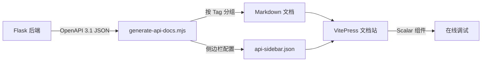

# 快速开始

## 项目简介

本平台是基于 **VitePress** 构建的企业级 API 文档系统，与 Flask 后端的 **OpenAPI 3.1** 规范实时同步。

### 核心特性

| 功能 | 说明 |
| --- | --- |
| 🔄 自动同步 | 运行脚本从后端拉取 OpenAPI spec，按 Tag 自动生成文档 |
| 🏷️ 标签分组 | 接口按 `Tag` 分类：ChatService、ImageService 等 |
| 🧪 在线调试 | 集成 Scalar API Reference，直接在浏览器中测试接口 |
| 🔍 全文搜索 | VitePress 内置本地全文搜索 |

## 开发环境搭建

### 1. 安装依赖

```bash
# 前端文档站
npm install

# Flask 后端
cd flask_api
python -m venv venv
.\venv\Scripts\pip install flask-openapi3 pydantic
```

### 2. 启动后端

```bash
cd flask_api
.\venv\Scripts\python app.py
```

后端将在 `http://127.0.0.1:5000` 启动，OpenAPI spec 地址为：

```
http://127.0.0.1:5000/openapi/openapi.json
```

### 3. 生成 API 文档

```bash
# 一次性生成
node scripts/generate-api-docs.mjs

# 开发模式（自动监听后端变更）
node scripts/generate-api-docs.mjs watch
```

### 4. 启动文档站

```bash
npx vitepress dev docs
```

## 工作原理



### 动态更新流程

1. 后端开发者修改 Flask 接口代码（Pydantic 模型、路由、Tag 等）
2. Flask `debug=True` 热重载后，OpenAPI spec 自动更新
3. `generate-api-docs.mjs watch` 持续轮询 spec 变更
4. 检测到变更后自动重新生成 Markdown 和侧边栏 JSON
5. VitePress HMR 自动刷新浏览器页面

## 添加新接口模块

在 `flask_api/api/` 目录下创建新模块：

```python
# flask_api/api/your_module.py
from flask_openapi3 import APIBlueprint, Tag
from pydantic import BaseModel, Field

# 定义 Tag（将自动成为文档分组名）
your_tag = Tag(name="YourService", description="你的服务描述")

# 创建蓝图
your_bp = APIBlueprint('your_module', __name__,
                        url_prefix='/api/your',
                        abp_tags=[your_tag])

class YourRequest(BaseModel):
    param: str = Field(..., description="参数描述")

class YourResponse(BaseModel):
    result: str = Field(..., description="返回值描述")

@your_bp.post('/', responses={"200": YourResponse})
def your_endpoint(body: YourRequest):
    """接口描述（将显示在文档中）"""
    return {"result": "ok"}
```

然后在 `app.py` 中注册：

```python
from api.your_module import your_bp
app.register_api(your_bp)
```

重新运行文档生成脚本即可看到新的分组和接口。
